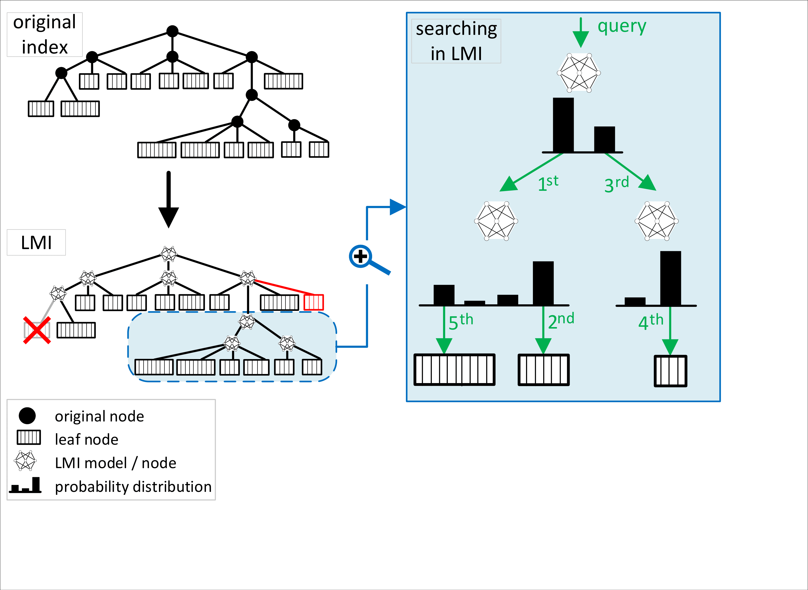

# This repo has become obsolete in favor of a more user-friedly implementation of LMI -- [TerkaSlan/Learned-Metric-Index-Framework](https://github.com/TerkaSlan/Learned-Metric-Index-Framework)

# Learned-indexes


## Paper accompanying this code
```
@article{antol2021learned,
  title={Learned Metric Index—Proposition of learned indexing for unstructured data},
  author={Antol, Matej and Ol’ha, Jaroslav and Slanin{\'a}kov{\'a}, Ter{\'e}zia and Dohnal, Vlastislav},
  journal={Information Systems},
  volume={100},
  pages={101774},
  year={2021},
  publisher={Elsevier}
}
```
Link to the Elsevier's Information Systems issue will be provided once the journal is published.

## Intro
This repository contains the code necessary to build with an example CoPhIR dataset of 100k objects included.
Currently supported ML models:
- Fully-connected NNs
- Logistic regression
- Fully-connected NNs trained in a Multi-label fashion
- Random Forests

## How to run
- Download the repo and run the code locally
    - python 3.x required
    - run `pip install -r requirements.txt` to install needed dependencies
    - run the introductory notebook (LMI Playground.ipynb), optionally download the dataset using `download_data.sh`
